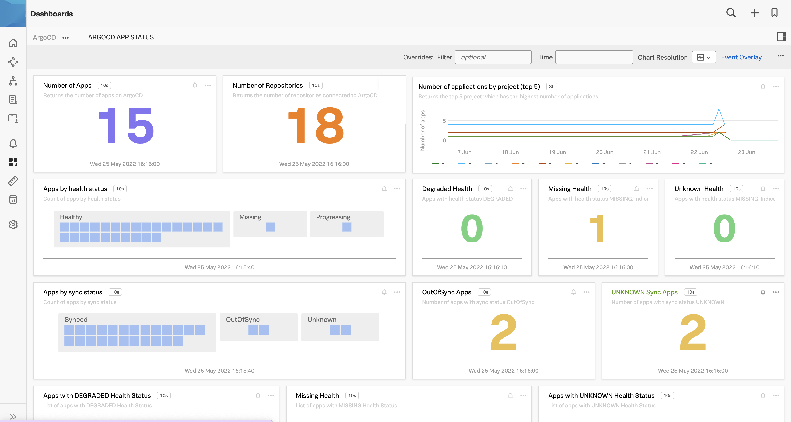

# Splunk Infrastructure Monitoring App for ArgoCD
ArgoCD observability dashboards for Splunk Infrastructure Monitoring. See Sample dashboard below.

ArgoCD servers produce a series of metrics which can be sent to Splunk Infrastructure Monitoring. The full list of metrics output by ArgoCD can be seen [here](https://argo-cd.readthedocs.io/en/stable/operator-manual/metrics/).

***
## Simple Setup
1. Set up Splunk Infrastructure Monitoring metrics ingestion
    1. Simplest method is to use [`Splunk Otel Collector`](https://github.com/signalfx/splunk-otel-collector) and expose the relevant ports for each [ArgoCD server](https://argo-cd.readthedocs.io/en/stable/operator-manual/metrics/).

2. Import dashboard module. Sample `dashboard.tf`
```
module "dashboard" {
    source              = "git::https://github.com/splunk/splunk-infrastructure-monitoring-app-for-argocd.git"
    sim_auth_token = var.sim_auth_token
    sim_api_url = var.sim_api_url
}
```
3. Declare variables. Sample `variables.tf`
```
variable "sim_auth_token" {
  type        = string
}
```
4. Apply terraform. Example using [terraform CLI commands](https://www.terraform.io/cli).
```
# to build
terraform init
terraform apply

# to destroy
terraform destroy
```
***
## File structure
```
📦 terraform-signalfx
 ┣ 📂 charts
 ┃ ┗ 📂 app_count
 ┃ ┗ 📂 degraded_health
 ┃ ┗ 📂 health_status
 ┃ ┗ 📂 highest_apps
 ┃ ┗ 📂 missing_health
 ┃ ┗ 📂 missing_health_list
 ┃ ┗ 📂 out_of_sync
 ┃ ┗ 📂 outofsync_sync_list
 ┃ ┗ 📂 repo_count
 ┃ ┗ 📂 sync_status
 ┃ ┗ 📂 unknown_health
 ┃ ┗ 📂 unknown_health_list
 ┃ ┗ 📂 unknown_sync
 ┃ ┗ 📂 unknown_sync_list
 ┣ 📂 dashboard_groups
 ┃ ┗ 📂 argocd_dashboard_group
 ┗ 📂 dashboards
 ┃ ┗ 📂 app_performance
```
***

## Sample Dashboard


***
## Splunk Copyright Notice

Copyright 2022 Splunk Inc.

Licensed under the Apache License, Version 2.0 (the "License"); you may not use this file except in compliance with the License. You may obtain a copy of the License at

http://www.apache.org/licenses/LICENSE-2.0

Unless required by applicable law or agreed to in writing, software distributed under the License is distributed on an "AS IS" BASIS, WITHOUT WARRANTIES OR CONDITIONS OF ANY KIND, either express or implied. See the License for the specific language governing permissions and limitations under the License.
